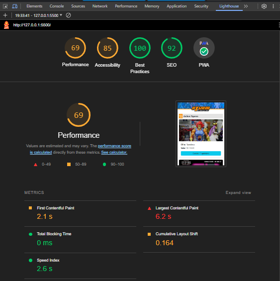
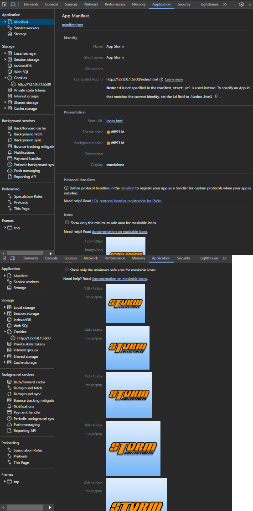

# Aplicativo de classificados de Brinquedos Colecionáveis

<p align="center">Esse projeto foi um desenvolvimento de uma aplicativo PWA de classificados de brinquedos colecionáveis.</p>

<b>Tabela de conteúdos</b>

- [PWA](#PWA)
- [Informações](#Informações)


# PWA ou Progressive Web App

PWA ou Progressive Web App ou Aplicativos Web Progressivos é uma abordagem de desenvolvimento de aplicativos da web que combina recursos de sites e aplicativos móveis para oferecer uma experiência de usuário aprimorada. Resumidamente, um PWA é:

- <b>Progressivo:</b> Funciona em qualquer navegador, independentemente do nível de suporte a recursos específicos.
- <b>Responsivo:</b> Adapta-se a diferentes tamanhos de tela e dispositivos.
- <b>Conectividade independente:</b> Funciona mesmo em conexões de internet instáveis ou offline.
- <b>Semelhante a um aplicativo:</b> Oferece uma experiência de usuário semelhante à de um aplicativo móvel, com recursos como notificações push e acesso à câmera.
- <b>Atualizado:</b> Sempre atualizado automaticamente, sem a necessidade de downloads ou atualizações manuais.
- <b>Seguro:</b> Usando HTTPS para proteger os dados dos usuários.

PWAs têm ganhado popularidade devido à sua capacidade de oferecer uma experiência de usuário de alta qualidade em dispositivos móveis e desktop, sem a necessidade de downloads de aplicativos tradicionais. Eles são construídos com tecnologias da web, como HTML, CSS e JavaScript, e podem ser acessados diretamente através de um navegador da web.

# Informações

## Ajax

<b>Ajax (Asynchronous JavaScript and XML)</b> é uma abordagem na programação web que permite a comunicação assíncrona entre o navegador e um servidor web. Ela permite que os navegadores solicitem e recebam dados do servidor em segundo plano, sem precisar atualizar toda a página. Isso significa que os dados podem ser carregados e exibidos dinamicamente em partes específicas de uma página web sem a necessidade de recarregar a página inteira.

Características principais do Ajax:

- <b>Comunicação Assíncrona:</b> O Ajax permite que as solicitações sejam feitas ao servidor e as respostas sejam recebidas de forma assíncrona. Isso significa que o usuário pode continuar interagindo com a página enquanto os dados são carregados em segundo plano.
- <b>Atualização de Conteúdo Dinâmico:</b> Com o Ajax, você pode atualizar partes específicas de uma página da web sem a necessidade de recarregar toda a página. Isso é útil para carregar novos dados, atualizar informações e interagir com o usuário sem interrupções.
- <b>Interação com o Servidor:</b> O Ajax é comumente usado para fazer solicitações ao servidor para buscar ou enviar dados, geralmente usando XML ou, mais comumente hoje, JSON como formato de dados.
- <b>JavaScript:</b> É geralmente implementado usando JavaScript e XMLHttpRequest ou a API Fetch no lado do cliente. No entanto, bibliotecas e frameworks como jQuery, Axios e o uso de APIs modernas, como o Fetch API, facilitam a implementação do Ajax.
- <b>Uso em Aplicações Web Interativas:</b> O Ajax é amplamente utilizado em aplicativos web interativos, como redes sociais, e-mails, aplicativos de mensagens instantâneas, previsões de pesquisa automática e muito mais.

O Ajax revolucionou a experiência do usuário na web, permitindo que páginas da web se tornassem mais dinâmicas e responsivas. Em vez de esperar que uma página inteira seja recarregada, os usuários podem ver atualizações e receber respostas imediatas, proporcionando uma experiência mais suave e interativa na web.

## dados.json

O arquivo dados.json é um arquivo JSON que armazena informações sobre brinquedos em diversas categorias. Aqui está uma explicação mais concisa da estrutura:

É um array JSON que contém objetos para categorias de brinquedos.
Cada categoria possui um nome ("categoria") e uma lista de brinquedos dentro dela.
Cada brinquedo tem um nome, uma imagem, um número de telefone do WhatsApp para contato e um preço.

Esse arquivo JSON é útil para armazenar e organizar informações sobre brinquedos em diferentes categorias, tornando-o adequado para a criação de um catálogo de brinquedos em uma aplicação web, permitindo aos usuários visualizar detalhes e posteriormente entrar em contato com os proprietários via WhatsApp, através como exemplo: https://api.whatsapp.com/send?phone=55319999999999&text=Ol%C3%A1%20gostaria%20de%20informa%C3%A7%C3%B5es%20sobre%20o%20brinquedo:%20ThunderCats

## favicon.ico

favicon é um pequeno ícone ou imagem que é associado a um site e exibido na barra de guias (abas) do navegador, na lista de favoritos e nos resultados de pesquisa. É uma parte importante da identidade visual de um site e ajuda os visitantes a identificar e lembrar de uma página da web.

Foi gerado um ícone da imagem através do site: https://www.favicon-generator.org/

A utilização do favicon.ico envolve a adição de dois elementos <b>link</b> no cabeçalho HTML da página.

```html
<link rel="shortcut icon" href="icons/favicon.ico" type="image/x-icon">
<link rel="icon" href="icons/favicon.ico" type="image/x-icon">
```

- <b><i>link rel="shortcut icon" href="icons/favicon.ico" type="image/x-icon"</i>:</b> Este elemento define o ícone que é exibido na barra de guias (ou abas) do navegador quando o usuário visita a página. É conhecido como o "favicon padrão". Através do atributo "href," você especifica o caminho para o arquivo favicon.ico.

- <b><i>link rel="icon" href="icons/favicon.ico" type="image/x-icon"</i>:</b> Este elemento é semelhante ao primeiro, mas é usado para garantir a compatibilidade com navegadores mais antigos que podem não reconhecer o elemento <b>link</b> "shortcut icon." É uma redundância que ajuda a garantir que o favicon seja exibido corretamente em uma ampla variedade de navegadores.

O atributo <b>type</b> define o tipo de arquivo, que é "image/x-icon" para arquivos favicon.ico.

A utilização de favicons é importante porque eles ajudam na identificação visual de um site e melhoram a experiência do usuário. Quando os visitantes têm várias guias abertas no navegador, o favicon ajuda a diferenciar e identificar rapidamente cada uma delas. Além disso, quando os usuários adicionam um site aos favoritos, o favicon geralmente é exibido junto ao título do site, tornando-o facilmente reconhecível na lista de favoritos. Portanto, a adição de favicons é uma prática comum para melhorar a usabilidade e a marcação de um site na web.

## Lighthouse

É uma ferramenta de código aberto desenvolvida pelo Google que é integrada ao navegador Google Chrome e serve para avaliar a qualidade e o desempenho de um site ou aplicativo da web. Ela fornece uma análise detalhada sobre diversos aspectos, incluindo desempenho, acessibilidade, boas práticas e SEO (otimização para mecanismos de busca). Aqui estão algumas das principais funções do LightHouse:

- <b>Auditoria de Desempenho:</b> O LightHouse avalia o desempenho de um site ou aplicativo, fornecendo métricas de carregamento, tempos de resposta e sugestões para melhorias. Ele pontua o desempenho com base em melhores práticas e fornece orientações para otimizar a velocidade de carregamento.
- <b>Teste de Acessibilidade:</b> O LightHouse verifica a acessibilidade de um site, identificando problemas que podem dificultar a navegação para pessoas com deficiências, como problemas de contraste, rótulos ausentes e outras barreiras de acessibilidade.
- <b>Auditoria de Boas Práticas:</b> Ele verifica o código-fonte em busca de boas práticas recomendadas para o desenvolvimento web, incluindo a garantia de que as tecnologias web modernas estão sendo usadas de maneira apropriada.
- <b>Auditoria de SEO:</b> O LightHouse fornece dicas e avaliações relacionadas à otimização para mecanismos de busca, identificando problemas que podem afetar a classificação nos resultados de pesquisa.
- <b>Auditoria de PWA (Progressive Web App):</b> Ele verifica se um site atende aos critérios de uma PWA, como a presença de um manifesto, serviço de trabalhador e outras tecnologias PWA.
- <b>Boas Práticas em Segurança:</b> LightHouse também verifica boas práticas de segurança, incluindo a presença de HTTPS e a segurança de conexões de rede.
- <b>Validação de Estrutura de Dados Estruturados:</b> Ele verifica se o site usa dados estruturados de maneira correta para melhorar a apresentação nos resultados de pesquisa.
- <b>Métricas de Performance:</b> Fornece métricas detalhadas sobre o desempenho da página, incluindo o tempo de carregamento, atraso da primeira pintura, atraso do primeiro conteúdo significativo e muito mais.

Os resultados são apresentados em uma interface amigável com uma pontuação geral e detalhes sobre os problemas encontrados. O LightHouse é amplamente usado por desenvolvedores e equipes de qualidade web para melhorar a qualidade e o desempenho de sites e aplicativos da web, além de garantir que eles atendam aos padrões de acessibilidade, boas práticas, SEO e PWA. Você pode acessar o LightHouse no Chrome DevTools, e também existem versões independentes disponíveis como uma extensão do navegador e uma ferramenta de linha de comando.

<p align ="center">
    
</p>

## manisfest.json

O arquivo manifest.json faz parte do conjunto de tecnologias usadas em Progressive Web Apps (PWAs) e desempenha um papel fundamental na configuração e na apresentação do aplicativo web para os usuários. O arquivo manifest.json contém os seguintes campos:

- <b>name e short_name:</b> Esses campos definem o nome do aplicativo. "name" é o nome completo do aplicativo, enquanto "short_name" é um nome abreviado que é usado quando há restrições de espaço, como nos ícones de aplicativos móveis.
- <b>icons:</b> Este campo lista os ícones associados ao aplicativo. Eles são usados para representar o aplicativo em diferentes contextos, como na tela inicial do dispositivo ou na guia do navegador. Cada objeto no array "icons" especifica o caminho para o ícone, seu tamanho e tipo.
- <b>start_url:</b> Define a URL de início do aplicativo, ou seja, a página inicial que será carregada quando o usuário abrir o aplicativo.
- <b>display:</b> Especifica como o aplicativo deve ser exibido. "standalone" significa que o aplicativo deve parecer e se comportar como um aplicativo móvel independente, sem a interface do navegador. Existem outras opções, como "fullscreen" e "minimal-ui".
- <b>background_color:</b> Define a cor de fundo da tela de inicialização do aplicativo. Isso garante uma experiência mais consistente para o usuário, enquanto o aplicativo está carregando.
- <b>theme_color:</b> Define a cor de destaque ou tema do aplicativo. Esta cor é usada para personalizar a interface do navegador e criar uma experiência mais coesa quando o aplicativo é usado.

O manifest.json é importante porque permite que os PWAs ofereçam uma experiência de usuário mais próxima à de aplicativos móveis nativos. Ele ajuda a configurar a identidade visual do aplicativo, facilita o acesso direto a partir da tela inicial do dispositivo e fornece informações sobre como o aplicativo deve se comportar. Quando bem configurado, o manifest.json contribui para uma experiência de usuário mais atraente e eficaz, incentivando os usuários a interagirem com o aplicativo de forma contínua.
<p align ="center">
    
</p>

Made with 💜 by Diego Henrique 👋 [See my Linkedin](https://www.linkedin.com/in/diegohts/)
